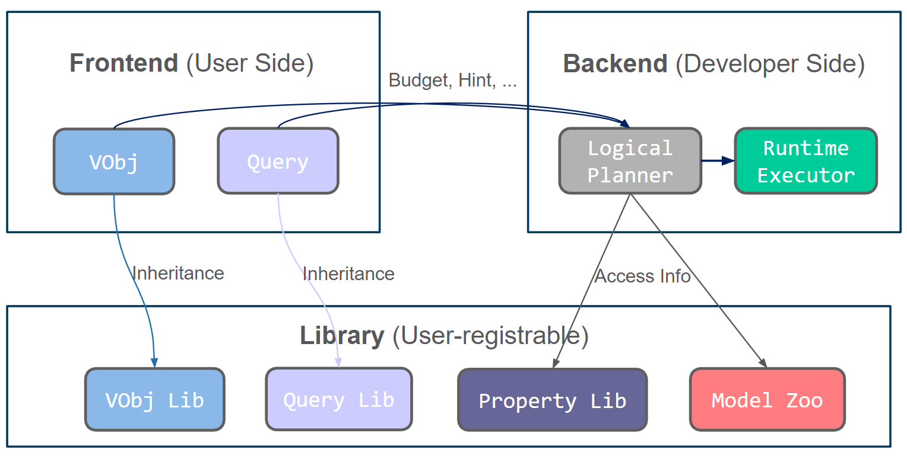

# VQPy : An object-oriented Video Query Language

[](https://github.com/uclasystem/VQPy/blob/main/LICENSE)

VQPy is an object-oriented language for modern video analytics. With VQPy, users can express their video queries in a composable and reusable manner with Python. 

VQPy is still under active development. VQPy compiler, which generates a query plan with optimized performance for users' video analytics applications, is working in progress. With VQPy compiler, users can simply focus on the declaration of video queries for their own applications, and multiple optimizations defined in the compiler will be transparently applied to the user’s video analytics pipeline.

## Getting Started

### Basic usage

In order to declare a video query with VQPy, users need to extend two classes defined in VQPy, namely `Query` and `VObj`. `VObj` defines the objects of interest (e.g., cars, humans, animals, etc.) in one or more video streams, and `Query` defines the video query. After declaration, the user can send the video feed and execution hints through the provided interface, and the backend will generate the execution plan and perform actual execution. The following graph illustrates the general structure of VQPy.

<div style="text-align: center">

</div>

#### Define a `VObj`

Users can define their own objects of interest, as well as the property in the objects they hope to query on, with a `VObj` class. To define a `VObj` instance, users are required to inherit the `vqpy.VObjBase` class; to define a property, the definition should start with a `@vqpy.property` decorator. Specifically, if a property is related to multiple objects, the definition should use `@vqpy.cross_object_property` instead of `@vqpy.property`.

For example, if we are interested in the vehicle object in the video, and want to query the license plate. We can define a `Vehicle` class as below.

```python
class Vehicle(vqpy.VObjBase):

    @vqpy.property()
    def license_plate(self):
        # infer license plate with vqpy built-in openalpr model
        return self.infer('license_plate', {'license_plate': 'openalpr'})
```

And if we are interested in the closest person to each of the `Baggage` object, we can declare a `closest_person` property as below. The `track_id` and `tlbr` of all `Person` objects are passed as argument accordingly.

```python
class Person(vqpy.VObjBase):
    pass


class Baggage(vqpy.VObjBase):

    @vqpy.property()
    @vqpy.cross_vobj_property(
        vobj_type=Person, vobj_num="ALL",
        vobj_input_fields=("track_id", "tlbr")
    )
    # function decorator responsible for retrieving list of properties
    # Person_id and Person_tlbr given as a list of track_id's and tlbr's
    def closest_person(self, person_ids, person_tlbrs):
        ...
```

Also, we can see a builtin interface `infer` provided by the library in the first example. In VQPy, there are two basic interfaces `infer` and `getv`, both of which are used to infer an attribute, typically an user-defined or pre-defined property in most cases.

There are two differences in the functions: `getv` can retrieve values in historic frames using `object.getv(property, index=)` if the property is marked by `@vqpy.stateful` decorator; `getv` consider user-defined names first and `infer` directly look up the library. Consequently, `infer` is mostly used when implementing the properties to avoid circular reference, and `getv` can be used as the interface to access the data within this object.

We also have some other decorators to simplify the definition of properties, like `@vqpy.postproc`, which provides basic postprocessing functions. For more details on how to use these decorators, please refer to our API document (TODO).

You can also refer to our [demos](https://github.com/uclasystem/VQPy/blob/main/README.md#customization) to see several example implementations of concerned objects.

#### Define a `Query`

Users can express their queries through SQL-like constraints with `VObjConstraint`, which is a return value of the `setting` method in their `Query` class. In `VObjConstraint`, users can specify query constraints on the interested object with `filter_cons`, and `select_cons` gives the projection of the properties the query shall return.

Moreover, users can provide some functions for the constraints and projections. In `filter_cons`, the functions should be boolean, and objects whose corresponding property has a `False` return value will not be selected. In `select_cons`, these functions serve as the postprocessing of the property value, and users can simply set the value to `None` if they want to output the value directly.

The code below demonstrates a query that selects all the `Vehicle` objects whose velocity is greater than 0.1, and chooses the two properties of `track_id`  and `license_plate` for return.

```python
class ListMovingVehicle(vqpy.QueryBase):

    @staticmethod
    def setting() -> vqpy.VObjConstraint:
        filter_cons = {'__class__': lambda x: x == Vehicle,
                       'velocity': lambda x: x >= 0.1}
        select_cons = {'track_id': None,
                       'license_plate': None}
        return vqpy.VObjConstraint(filter_cons=filter_cons,
                                   select_cons=select_cons)
```

We also have a utility function named `vqpy.utils.continuing`, which checks whether a condition function continues to be true for a certain duration. For the detailed usage, please refer to our [People Loitering](examples/loitering) example.

#### Launch the task

After declaring `VObj` and `Query`, users should call the `vqpy.launch` function to deploy the video query, below is an example of this interface. Users should specify the detection class they expect, and map the object detection result to the defined VObj types.

```python
vqpy.launch(cls_name=vqpy.COCO_CLASSES, # detection class
            cls_type={"car": Vehicle, "truck": Vehicle}, # mappings from detection class to VObj
            tasks=[ListMovingVehicle()], # a list of Queries to apply
            video_path=args.path, # the path of the queried video
            save_folder=args.save_folder, # result of query will be saved as a json file in this folder
            detector_name="yolox", # optional, specify the name of user's own model
            detector_model_dir=args.pretrained_model_dir # optional, specify the directory of user's pretrained model
            )
```

Under the hood, VQPy will automatically select an object detection model that outputs the specified `cls_name`, and decide the workflow to generate the object properties. Multiple video optimizations will be conducted transparently to improve the end-to-end video query performance.

## Examples

We have included several examples for demonstrating VQPy.

- [Fall Detection](examples/fall_detection): detect people in the video and recognize fallen person.
- [List red moving vehicle](examples/list_red_moving_vehicle): show license plate of red moving vehicle.
- [People Loitering](examples/loitering): count the number of person loitering around.
- [People Counting](examples/people_counting): count the number of person heading both directions. 
- [Unattended Baggage Detection](examples/unattended_baggage): detect unattended baggages.

These examples can well demonstrate what VQPy can do and how to use VQPy.

### Customization

In VQPy, users can also add their own function and models by using the built-in interfaces. These interfaces are also used for functions and models in the library. The following sections gives a general view on customization, but for the detailed usage, please refer to our API document (TODO).

#### Library property

To register a library property, we can use `@vqpy.vqpy_func_logger` decorator, with the following interface, as in the following example:

```python
def vqpy_func_logger(input_fields, output_fields, past_fields,
                     specifications=None, required_length=-1):
    """ input_fields: required fields in this frame.
        output_fields: fields the function can generate.
        past_fields: required fields in past frames.
        specifications: preference of the function.
        required_length: the required track length for this function. """
    ...

@vqpy_func_logger(['tlbr'], ['bottom_center'], [], required_length=1)
def bottom_center_coordinate(obj, tlbr):
    """compute the coordinate of bottom center of the bounding box"""
    x = (tlbr[0] + tlbr[2]) / 2
    y = tlbr[3]
    return [(x, y)]
```

#### Detector

Under normal conditions, users do not need to provide a detector implementation. However, if the user have a detector, they can inherit `vqpy.detector.DetectorBase` and implement the required interfaces, and use `vqpy.detector.register` to register the detector. The return value of `inference` should be a list of dictionaries, representing the properties and the corresponding value for each detected object.

```python
class DetectorBase(object):
    """The base class of all detectors"""
    cls_names = None        # the class names of the classification
    output_fields = []      # the list of data fields the predictor can provide

    def __init__(self, model_path: str) -> None:
        self.model_path = model_path

    def inference(self, img: np.ndarray) -> List[Dict]:
        """Get the detected objects from the image
        img (np.ndarray): the inferenced images
        returns: list of objects, expressed in dictionaries
        """
        raise NotImplementedError
```

#### Tracker

There are two level of trackers in VQPy. The surface level tracker stores the `VObj` instances by classes, and this is where `VObj` instances are created. For the default surface level tracker, different classes will be tracked separately using the ground level tracker. This level of tracker should generate the `track_id` field based on the provided detection result in this frame. Clearly, these trackers should be able to memorize historic detection results.

Currently, we only support the customization of ground level tracker. Users should inherit the following `GroundTrackerBase` and register it to our backend using `vqpy.tracker.register(ground_tracker=)`. The customized tracker takes the output of detector as input and generate the `track_id` field and possibly some other fields for each object. Then it should return two list of objects, one representing the current tracked objects, and one representing the tracklets we have currently lost, but might rediscover in the future.

```python
class GroundTrackerBase(object):
    """The ground level tracker base class.
    Objects of this class approve detections results and associate the
    results with necessary data fields.
    """
    input_fields = []       # the required data fields for this tracker
    output_fields = []      # the data fields generated by this tracker
    def __init__(self, stream: FrameStream):
        ...
    def update(self, data: List[Dict]) -> Tuple[List[Dict], List[Dict]]:
        """Filter the detected data and associate output data
        returns: the current tracked data and the current lost data
        """
        ...
```